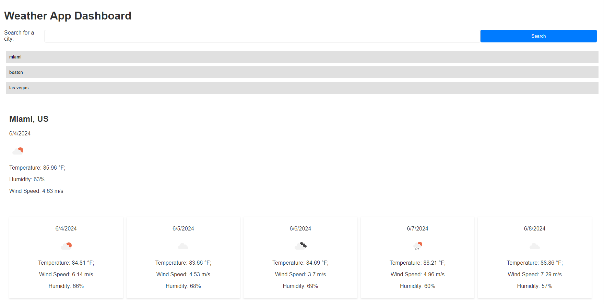

# Weather-App-Dashboard

# Built With
-HTML
-CSS3
-Bootstrap
-JavaScript
-jQeury
-Dayjs

# Description

The Weather Dashboard lets users search for any given city. When you search for a city you will get the current weather, as well as a five day forecast. The results that are displayed are temperature in °F, wind-speed, and humidity. When you search for a city it will be saved in the local storage, so that you can see a list of past searched cities.

# Installation

git clone https://github.com/BPouliot1/Weather-App-Dashboard.git

# Usage

Open index.html file and search for the weather of a city

# Visual

Live Website https://bpouliot1.github.io/Weather-App-Dashboard/

